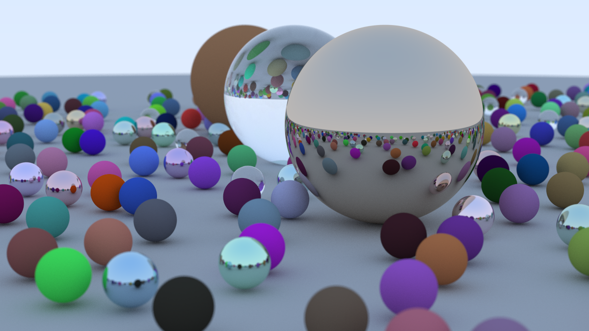

A simple ray tracer I wrote follwing [Ray Tracing in One Weekend](https://raytracing.github.io/books/RayTracingInOneWeekend.html).





Compile for debug
```
cl /std:c++20 /Zi main.cc /link /DEBUG:FULL /OUT:ray.exe
```

Compile for release
```
cl /std:c++20 /O2 /D "NDEBUG" main.cc /link /OUT:ray.exe
```

How to run
```
ray.exe > image.ppm
```

Debugging in Visual Studio 
```
devenv /DebugExe ray.exe
```